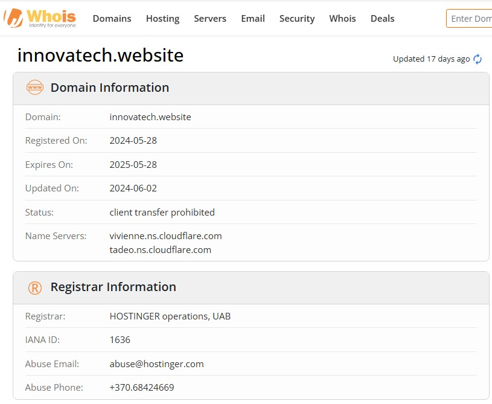

 <h2>
 Phishing-Email-Analysis-Report
</h2>
 <h2>
 By:</p</h2>
<h2>
 Ogunsanwo Adeniyi Nelly, Cybersecurity Analyst</p</h2
                                                                           <h2>
 Date 24th of April 2025
</h2>

 
<h3> <li>Phishing Email Analysis Summary</li></h3>
Performed a detailed investigation of a suspicious email received through the corporate email gateway. The message was securely isolated in a sandboxed Virtual environment and analyzed using advanced techniques, including header inspection, URL reputation checks, and threat intelligence correlation. Findings confirmed the email was a phishing attempt aimed at directing users to a malicious link for potential credential compromise or malware delivery.
 

<h3><li> Email Metadata Analysis</li></h3>

<b>1. Sender Information</b>

 <ul>
  <li> <strong>Return Path:</strong> apache@sk.globalexceltrade.xyz </li>
  
   <li> <strong> SeSender IP Address:</strong> 151.80.93.107 </li>
   <li> <strong>IP Reputation Check (AbuseIPDB):</strong>  No existing reports were freports does not indicate safety, especially given the suspicious context.ound for this IP address in the AbuseIPDB database. However, the lack of </li> 
</ul>

<li> <b>⦁	nding Server:</b> SJ1P223MB0531.NAMP223.PROD.OUTLOOK.COM (::1)
</li>

 

<li> <h3>2 Email Authentication Results</h3> </li>

<li> <b>	SPF (Sender Policy Framework):</b> PASS </li>
 
<li>  	The SPF record validated successfully, suggesting that the sending server is authorized to send mail on behalf of the domain. However, SPF alone is not a reliable indicator of legitimacy.  </li>

 
<li> <b>	DKIM (DomainKeys Identified Mail):</b> NONE   </li>
 

<li> 	No DKIM signature was present, indicating the email was not cryptographically signed. This reduces the credibility and makes the email susceptible to spoofing.  </li>
 
<li> <b>DMARC (Domain-based Message Authentication, Reporting, and Conformance):</b> NONE  </li>
 
<li> 	The domain lacks a DMARC policy, increasing the likelihood of unauthorized use and spoofing. </li>

 

<li>  <h3>3 Embedded URL Analysis</h3> </li>

<li>  <b>1 Suspicious Link</b>  </li>

<li> 	<strong>URL Found in Email:</strong> <a href="https://innovatech.website">https://innovatech.website</a>
</li>

 

<li> 	I extracted the link and performed scans using the following tools: </li>

<li> <b>URLScan.io</b> </li>

<li> <b>VirusTotal</b> </li>

<li> <b>Bluecoat SiteReview</b> </li>

<li> <h3>2 Threat Intelligence on Domain</h3> </li>

<li> <b> Domain:</b> ⦁	 innovatech.website </li>

<li><b>A WHOIS</b> lookup revealed </li> 

<ul>
<li>Registrar: HOSTINGER operations, UAB </li>
<li>Registered On:2024-05-28 </li>
 </ul>
The domain appears to be newly registered and lacks a solid reputation, which is consistent with common phishing infrastructure.

 

<li> <h3>4 Threat Intelligence Analysis</h3> </li>
<li> <b>1 IP Address Reputation</b> </li>
<li>	<strong>IP Address:</strong> 151.80.93.107 </li>
<li> The IP address did not return any reports on AbuseIPDB. However, attackers often rotate IPs and domains, so absence of prior activity does not imply trustworthiness.</li>

 
<li> <h3>2 Indicators of Compromise (IoCs)</h3> </li>
<li> <b>Email Header Anomalies:</b> Missing DKIM/DMARC, mismatched Return-Path and sending server. </li>
<li> <b>Malicious URL:</b> The URL embedded in the email links to a suspicious domain. </li>
<li> <b>Unusual Return-Path Domain:</b> sk.globalexceltrade.xyz is a non-standard and suspicious domain name </li>

<li> <h3>5 Conclusion & Recommendations</h3> </li>
<li> <b>1 Conclusion</b> </li>
 

Based on comprehensive email header inspection, authentication failures, and third-party threat intelligence scans, I assess this email to be a <b>confirmed phishing attempt.</b> The email was crafted to trick recipients into clicking a potentially malicious link hosted at innovatech.website. The domain and IP involved exhibit red flags consistent with phishing infrastructure.

 
<li> <b>2 Recommendations</b> </li>

<li> <b>Immediate Quarantine:</b> Ensure the email is removed from all user inboxes.</li>
<li> <b>	Block Indicators:</b> Add innovatech.website and 151.80.93.107 to all perimeter security blocklists (firewall, proxy, email gateway).</li>
<li> <b>	Report to Authorities:</b>
<li> Report the phishing attempt to Microsoft via the Security & Compliance Center.</li>
<li> Submit indicators to APWG and Google Safe Browsing.</li>
<li> <b>	Security Awareness Campaign:</b> Notify users about this phishing attempt and reinforce phishing awareness training. </li>
<li> <b>	Enhance Email Filtering:</b> Strengthen email gateway rules to enforce strict DMARC/DKIM/SPF policies. </li>
<li> <b>Threat Hunting:</b> Initiate monitoring of internal logs and endpoints for any interaction with the flagged domain/IP </li>

 

 

  

 <pre>
<b>Report Prepared by:</b>
<b>Ogunsanwo Adeniyi Nelly</b>
Cybersecurity Analyst
  </pre>

 

peace: &#x1f54a;......

